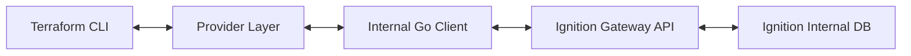

This document outlines the technical design of the `ignition-tofu` provider, explaining how Terraform configuration maps to Ignition Gateway resources.

## High-Level Overview

The provider serves as a bridge between the **HashiCorp Terraform Plugin Framework** and the **Ignition Gateway REST API** (`/data/api/v1`). It is written in Go and structured into three primary layers.

## Component Layers

### 1. Provider Layer (`internal/provider`)

This layer implements the Terraform protocol. It defines the Schema (attributes, types, validation) for Resources and Data Sources.

- **Schema Mapping**: Converts Terraform HCL attributes (snake_case) into Go structs.
- **State Management**: Handles the Terraform State (`terraform.tfstate`), ensuring drift detection works correctly.
- **Generic Implementation**: Uses a generic `GenericIgnitionResource[T]` wrapper to standardize Create, Read, Update, and Delete (CRUD) logic across mostly uniform Ignition resources, reducing code duplication.

### 2. Client Layer (`internal/client`)

A dedicated Go client that handles the HTTP communication with the Ignition Gateway.

- **Retry Logic**: Uses `hashicorp/go-retryablehttp` to handle transient network failures or Gateway restarts (common during config updates).
- **Type Definitions**: Contains Go struct definitions for Ignition's configuration objects (e.g., `Project`, `DatabaseConfig`, `TagProviderConfig`).
- **Resource Waiting**: Implements specific polling logic for heavy resources like Projects, which may take moments to initialize after creation.

### 3. Security & Crypto

Ignition requires specific handling for sensitive fields like Database passwords or SMTP credentials.

- **Encryption**: The provider does **not** send passwords in plaintext in the JSON body.
- **Encryption Endpoint**: It uses the `/data/api/v1/encryption/encrypt` endpoint to transform a plaintext secret into an **Embedded Secret** (JWE format) understood by the Gateway.
- **State Storage**: The encrypted value (JWE) or the state signature is stored in Terraform state, ensuring the plaintext password is never exposed in API logs, though it must exist in the Terraform configuration.

## Resource Lifecycle

When you apply a configuration:

1. **Plan**: Terraform compares your HCL config with the stored State and the live Gateway configuration (Read).
2. **Create/Update**:
    - The provider maps the plan to a specific Go struct (e.g., `DatabaseConfig`).
    - Sensitive fields are sent to the encryption endpoint.
    - The final JSON is POST/PUT to the resource endpoint (e.g., `/data/api/v1/resources/ignition/database-connection`).
3. **Read (Refresh)**:
    - The provider fetches the resource by Name.
    - It compares the returned configuration with the State.
    - **Note**: The API often does not return sensitive fields (like passwords). The provider handles this by preserving the existing state value if the API response is empty for that field, preventing perpetual diffs.

## Singleton Resources

Some Ignition settings are global (Singletons), such as:

- **Redundancy Settings**
- **Gateway Network (GAN) Settings**

The provider treats these as resources with a fixed name (e.g., `gateway-redundancy`). Deleting these resources in Terraform usually implies reverting them to a default "safe" state (e.g., Independent role) rather than "destroying" the configuration, as these settings cannot truly be removed from the Gateway.
