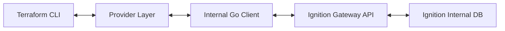

This document outlines the technical design of the `ignition-tofu` provider, explaining how Terraform configuration maps to Ignition Gateway resources.

## High-Level Overview

The provider serves as a bridge between the **HashiCorp Terraform Plugin Framework** and the **Ignition Gateway REST API** (`/data/api/v1`). It is written in Go and structured into three primary layers.

```mermaid
flowchart LR
    TF[Terraform CLI] <--> Provider[Provider Layer]
    Provider <--> Client[Internal Go Client]
    Client <--> API[Ignition Gateway API]
    API <--> Config[Ignition Internal DB]
```

## Component Layers

### 1. Provider Layer (`internal/provider`)

This layer implements the Terraform protocol. It defines the Schema (attributes, types, validation) for Resources and Data Sources.

- **Schema Mapping**: Converts Terraform HCL attributes (snake_case) into Go structs.
- **State Management**: Handles the Terraform State (`terraform.tfstate`), ensuring drift detection works correctly.
- **Generic Implementation**: Uses a generic `GenericIgnitionResource[T]` wrapper to standardize Create, Read, Update, and Delete (CRUD) logic across mostly uniform Ignition resources, reducing code duplication.

### 2. Client Layer (`internal/client`)

A dedicated Go client that handles the HTTP communication with the Ignition Gateway.

- **Retry Logic**: Uses `hashicorp/go-retryablehttp` with up to 10 retries to handle transient network failures or Gateway restarts. Configuration changes in Ignition often trigger module restarts; the client is designed to persist through these periods.
- **Type Definitions**: Contains Go struct definitions for Ignition's configuration objects (e.g., `Project`, `DatabaseConfig`, `TagProviderConfig`).
- **Resource Waiting**: Implemented polling logic for resources that are not immediately available after creation, such as Projects (which poll every 200ms for up to 10s).

### 3. Security & Crypto

Ignition requires specific handling for sensitive fields like Database passwords or SMTP credentials.

- **Encryption**: The provider does **not** send passwords in plaintext in the JSON body.
- **Encryption Endpoint**: It uses the `/data/api/v1/encryption/encrypt` endpoint to transform a plaintext secret into an **Embedded Secret** (JWE format). This happens in-flight during the `Create` or `Update` phase.
- **State Storage**: The encrypted value or the state signature is stored in Terraform state, ensuring the plaintext password is never exposed in API logs or stored unencrypted in the state file.

## Key Abstractions

### Signatures & Concurrency

Most Ignition resources utilize a **Signature** (a unique hash of the current configuration). 

- **Optimistic Locking**: When updating or deleting a resource, the provider sends the last known signature. If the resource was modified manually in the Gateway since the last Terraform run, the signatures will mismatch, and the API will reject the change.
- **Automatic Reconciliation**: Terraform handles this via drift detection. A `terraform plan` will fetch the latest signature and configuration, allowing you to reconcile changes safely.

### Gateway Restarts & Persistence

Certain resources (like Database Connections or OPC UA Devices) may trigger a module-level restart when their configuration is changed.

- **Retry Policy**: The internal client uses a backoff-retry strategy. If the Gateway API becomes temporarily unavailable during a restart, the provider will wait and retry the operation until it succeeds or the 10-attempt limit is reached.
- **Project Polling**: Projects involve file-system operations on the Gateway. The provider includes a specific "wait-for-ready" lifecycle step to ensure the project is fully initialized before returning control to Terraform.

## Resource Lifecycle

When you apply a configuration:

1. **Plan**: Terraform compares your HCL config with the stored State and the live Gateway configuration (Read).
2. **Create/Update**:
    - The provider maps the plan to a specific Go struct (e.g., `DatabaseConfig`).
    - Sensitive fields are sent to the encryption endpoint.
    - The final JSON is POST/PUT to the resource endpoint (e.g., `/data/api/v1/resources/ignition/database-connection`).
3. **Read (Refresh)**:
    - The provider fetches the resource by Name.
    - It compares the returned configuration with the State.
    - **Note**: The API often does not return sensitive fields (like passwords). The provider handles this by preserving the existing state value if the API response is empty for that field, preventing perpetual diffs.

## Singleton Resources

Some Ignition settings are global (Singletons), such as:

- **Redundancy Settings**
- **Gateway Network (GAN) Settings**

The provider treats these as resources with a fixed name (e.g., `gateway-redundancy`). Deleting these resources in Terraform usually implies reverting them to a default "safe" state (e.g., Independent role) rather than "destroying" the configuration, as these settings cannot truly be removed from the Gateway.
