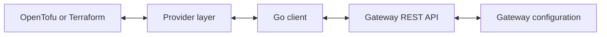

This page describes how the `ignition` provider turns OpenTofu or Terraform configuration into calls to the Ignition gateway's REST API. It is for contributors and for users who want to understand how the provider behaves during `plan` and `apply`.

## Overview

The provider is written in Go with the [Terraform Plugin Framework](https://developer.hashicorp.com/terraform/plugin/framework). It talks to the gateway's REST API under `/data/api/v1` and has two layers: the provider layer, which implements the plugin protocol, and a client layer, which makes the HTTP requests.

```mermaid
flowchart LR
    CLI[OpenTofu or Terraform] <--> Provider[Provider layer]
    Provider <--> Client[Go client]
    Client <--> API[Gateway REST API]
    API <--> Config[Gateway configuration]
```

## Provider layer

The provider layer (`internal/provider`) defines the schema of each resource and data source: its attributes, types and validation.

- **Schema mapping**: each resource maps its HCL attributes to the Go structs the client sends to the gateway, and maps the gateway's response back to state.
- **Shared lifecycle**: most resources use the generic `GenericIgnitionResource[T, M]` type in `internal/provider/base`, which implements create, read, update and delete once. Each resource supplies only its mapping between state and the gateway's configuration.

## Client layer

The client (`internal/client`) handles HTTP communication with the gateway and authenticates with the `X-Ignition-API-Token` header.

- **Retries**: the client uses `hashicorp/go-retryablehttp` with up to 10 retries and a 10-second timeout per request. Configuration changes often restart a gateway module, and the retries let a request succeed once the module is back.
- **Types**: the client defines Go structs for the gateway's configuration objects, such as `Project`, `DatabaseConfig` and `TagProviderConfig`.
- **Waiting for projects**: after creating a project, the client polls the gateway every 200 ms, for up to 10 seconds, until the project can be read.

## Secrets

Some attributes, such as database and SMTP passwords, notification profile passwords and OIDC client secrets, are secrets.

- **Encryption by the gateway**: before writing a secret to the gateway configuration, the provider sends it to the gateway's `/data/api/v1/encryption/encrypt` endpoint, which returns an embedded secret in JWE format. The provider includes the encrypted value, not the plaintext, in the resource's configuration.
- **State**: secret attributes are marked sensitive, so `plan` and `apply` output hides them. As with any value in your configuration, the value you set is stored in state, so keep your state secure.
- **Refresh**: the gateway does not return secrets when the provider reads a resource, so the provider keeps the value already in state. This avoids a permanent difference in every plan.

## Signatures

Most gateway resources carry a **signature**: a value that changes whenever the resource's configuration changes.

- The provider stores the signature in state and sends it with each update and delete.
- If the resource changed on the gateway after the provider last read it, the signature no longer matches and the gateway rejects the change.
- `plan` refreshes each resource, including its signature, so a fresh plan picks up changes made in the Designer or the gateway web interface and shows them as drift.

## Resource lifecycle

When you run `apply`:

1. **Plan**: the CLI compares your configuration with state, after the provider has refreshed state from the gateway.
2. **Create or update**:
    - The provider maps the plan to the resource's Go struct, such as `DatabaseConfig`.
    - Secrets are encrypted through the encryption endpoint.
    - The provider sends the configuration to the resource's endpoint, for example `/data/api/v1/resources/ignition/database-connection` for most resources, or `/data/api/v1/projects` for projects.
3. **Read**: the provider fetches the resource by name, maps the response back to state, and keeps secret values that the gateway does not return.

## Singleton resources

Some gateway settings exist exactly once per gateway:

- `ignition_redundancy` (fixed name `gateway-redundancy`)
- `ignition_gan_settings` (fixed name `gateway-network-settings`)

The settings always exist, so creating one of these resources updates the gateway's current settings. They cannot be removed from the gateway, so destroying `ignition_redundancy` resets the gateway to the independent role with default settings, and destroying `ignition_gan_settings` only removes it from state.
